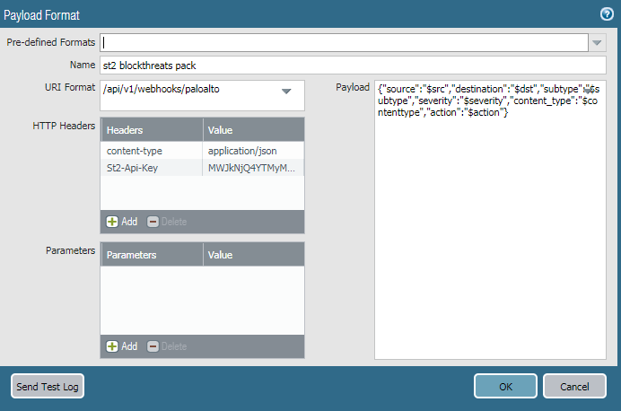

# Palo Alto Networks Pack based on pan-python

## pan-python

This pack leverages the features available in the pan-python package created by [Kevin Steves](https://github.com/kevinsteves)

* [pan-python](https://github.com/kevinsteves/pan-python) repository
* [pan-python](https://pypi.org/project/pan-python/) on pypi.org

pan-python was selected as the underlying package because of a few reasons:

* It is deisgned to be a transparent interactor between Palo Alto API endpoints, and not a command interpreter.
  * Though there is a compiled CLI version of pan-python
* It is the reccomended library by Palo Alto on a wide range of resources
* It is the same library that the popular tool [pandevice](https://pandevice.readthedocs.io/en/latest/) is built ontop of
* It is fully featured and supports capabilities with the following API Endpoints:
  * [XML API](https://docs.paloaltonetworks.com/pan-os/9-0/pan-os-panorama-api.html) on Panorama and Firewall devices (XApi)
  * [WildFire API](https://docs.paloaltonetworks.com/wildfire/u-v/wildfire-api/get-started-with-the-wildfire-api) (WFApi)
  * [AutoFocus API](https://docs.paloaltonetworks.com/autofocus/autofocus-api.html) (AFApi)
  * [Licensing API](https://docs.paloaltonetworks.com/vm-series/9-1/vm-series-deployment/license-the-vm-series-firewall/licensing-api.html) (LicAPI)

pan-python is included in [requirements.txt](./requirements.txt)

# Quick-Start

1. Install the pack: `st2 pack install paloalto`
2. Run the 'show system info' action to get device details: `st2 run paloalto.xapi.op.show_system_info hostname='<firewall or panorama hostname/ip>' api_username='<username>' api_password='<password>'`

# Configuration

To create and install the config file, you can run:

`st2 pack config paloalto`

Alternatively, you can copy the example configuration in
[paloalto.yaml.example](./paloalto.yaml.example)
to `/opt/stackstorm/configs/paloalto.yaml` and edit as required.

`connections` is a parent key that contains a dictionary of connections that can be referenced by name to use as the connection parameters for an action. (Big thanks to the team at Encore Technologies for being my reference material on this aspect of the pack)

Each connection should be a dictionary with the one or more of the following keys.

Example:

```yaml
---
connections:
  prod_panorama:
    hostname: <value>
    api_key: <value>
  test_panorama:
    hostname: <value>
    api_username: <value>
    api_password: <value>
  autofocus:
    hostname: autofocus.paloaltonetworks.com
    api_key: <value>
```

You can then reference the name of the key in the `connection_name` parameter of the action to load that connection.

Alternatively, you can pass any of the relevant fields directly to the action at run time if you would like. This is entirely your preference.

When conflicting values are provided (specifying `connection_name` as well as an API Key in the action for example), the pack will resolve the conflict with the following priority:

1. Action values override the values imported from the config by `connection_name` (Pack determined logic)
2. When a User/Pass and API Key is provided, the API Key will be prefered (pan-python determined logic)

For example; if you supply an API Key and User/Pass in the config and reference it in the action, as well as an API Key and User/Pass in the action fields directly, you will connect using the API Key supplied directly to the Action at run time.

This behavior is the same for any connection related parameter (serial, http, port, etc)

##### Reccomendation

You can also use dynamic values from the datastore for sensitive information. See the [docs](https://docs.stackstorm.com/reference/pack_configs.html) for more info.

An example of this is provided in [the example config](./paloalto.yaml.example).
You can set this value with `st2 key set '<key name>' '<value>' --encrypt` and reference in your config with `"{{ st2kv.system.<key name> | decrypt_kv }}"`

**Note** : When modifying the configuration in `/opt/stackstorm/configs/` please remember to tell StackStorm to load these new values by running `st2ctl reload --register-configs`

# Pack Design

## Action Naming

`apiendpoint.method.specific_usage`

Actions are named with a prefix of the API Endpoint they are used with. This was done so that there would be clean future compatibility with new API endpoints that Palo Alto develops and is supported by pan-python, or when it makes sense to create a dedicated action to a usage of a method (Example: [`xapi.op.show_system_info`](./actions/xapi.op.show_system_info.yaml))

The next field denotes the method being called within the relevant module (pan.xapi.PanXApi)

The last field (if present) is used for when there is a specific use of an `endpoint.method` action. (Example: [`xapi.op.show_system_info`](./actions/xapi.op.show_system_info.yaml))

## Code Structure

* [base.py](./actions/lib/base.py) - Containers all the shared logic used by every python action
* [pan{x,wf,lic,af}api_action.py](./actions) - A specific python action for a given endpoint.
  * Each endpoint has a slightly different way to handle the result data
  * `API_METHOD_LIST` - Defines the methods that a given endpoint has in pan-python (used for validation prior to execution)
  * `CONNECTION_FIELDS` - The fields available for building the connection with this API endpoint (used for validation prior to connection)
  * `module` - The base module in pan-python that will be used (Effectively the API Endpoint)
  * `module_class` - The Class to be loaded that will be used to execute API requests
    * The relevant "Error" class is loaded based on a consistent naming convention (PanXApi and PanXApiError)

##### Tricks Used

* Overlapping parameter names - pan-python vs action inputs
  * [base.py](./actions/lib/base.py) `_parameter_housekeeping()`
  * Any kwarg (parameter) prefixed with `action_` will be replaced with a kwarg of the same name without the `action_` prefix after `_setup_connection()`is called.
    * There is potential for overlapping parameter names between a pan-python method, and the connection client (XAPI). There needs to be a way to ensure the correct parameter is passed to pan-python for connection Vs a method.
      * Example: `timeout` needed for the api connection, and `action_timeout` needed for waiting for a commit to finish.
* Shortcut Actions
  * [base.py](./actions/lib/base.py) `_parameter_housekeeping()`
  * You can create shortcut actions to simplify a complex action usage by adding additional parameters to an action definition (`action.name.yaml`).
  * Any kwarg (parameter) prefixed with a single underscore (`_`) will be thrown away at execution.
    * To aid in creating simplified (shortcut) actions from base methods (`xapi.commit` for example) there needed to be a way to mark a parameter that it can be just thrown away as soon as the action is successfulled scheduled.
      * Example: [`xapi.commit.panorama.device_group`](./actions/xapi.commit.panorama.device_group.yaml) parameter: `_device_group`
    * If you compare the example to [`xapi.commit`](./actions/xapi.commit.yaml), you will see that the `cmd` parameter has been set to `immutable: true`, the default is more complex commit string, but with a reference to a new parameter: `_device_group` that now functions as a single input for the user, that will be used to expand `cmd`.
    * `_device_group` will be discarded when the action runs, because its only needed to expand the default of `cmd`. This means you can add any required parameter, as long as its prefixed with an underscore (`_`).
* CLI Commands requiring a user prompt (example: `Continue [Y/n]: Y`)
  * [netmiko_action.py](./actions/netmiko_action.py) `run()`
  * This method looks for the parameter `prompt`, if present; send the string in the parameter `prompt` as a cli command.
    * There are use cases where some CLI commands ask for a response from the user.  This enables a workaround to complete the command.
    * The action `cli.raw` has this parameter as non-immutable to allow for custom prompt inputs.

# References

##### pan-python
* [pan-python Repository](https://github.com/kevinsteves/pan-python)
* XApi - [pan.xapi](https://github.com/kevinsteves/pan-python/blob/master/doc/pan.xapi.rst)
* WildFire - [pan.wfapi](https://github.com/kevinsteves/pan-python/blob/master/doc/pan.wfapi.rst)
* Autofocus - [pan.afapi](https://github.com/kevinsteves/pan-python/blob/master/doc/pan.afapi.rst)
* Licensing - [pan.licapi](https://github.com/kevinsteves/pan-python/blob/master/doc/pan.licapi.rst)

##### Palo Alto APIs
* [XML API](https://docs.paloaltonetworks.com/pan-os/9-0/pan-os-panorama-api.html) on Panorama and Firewall devices (XApi)
* [WildFire API](https://docs.paloaltonetworks.com/wildfire/u-v/wildfire-api/get-started-with-the-wildfire-api) (WFApi)
* [AutoFocus API](https://docs.paloaltonetworks.com/autofocus/autofocus-api.html) (AFApi)
* [Licensing API](https://docs.paloaltonetworks.com/vm-series/9-1/vm-series-deployment/license-the-vm-series-firewall/licensing-api.html) (LicAPI)

# Future

* Unit Testing
* Sensors for common use-cases
* python action for running an XML diff (for comparing Running Vs Candidate configs)

# Original Palo Alto Networks Pack (Deprecated)

## Deprecation

pandevice has been overhauled and deprecated, and it also had significant limitations compared to pan-python. This has nothing to do with code quality. pan-device created specific logic on a per usage basis that requires any new capbilities to also have use-specific logic created. Pan-python simply provides a way to interact with the api directly, and any use cases are just different ways of using the same methods.

For example, `xapi.op` simply takes the command string provided, and passes it to the `op` method, which corresponds to the api as [`action=op`](https://docs.paloaltonetworks.com/pan-os/9-0/pan-os-panorama-api/pan-os-xml-api-request-types/pan-os-xml-api-request-types-and-actions/request-types.html#id402b6ebc-9ea7-4d7c-8bcf-fa0444ea252a)

Using an underlying package that doesn't restrict capabilities enables more automation usecases in stackstorm.

Pan-device has recently been rebranded as pan-os-python but continues a similar philosophy.

#### Timeline

There is no strict timeline targetted for retiring the older logic, but since there has been a major change with pan-device, there will be minimal to no support provided for it. Please take steps to migrate your logic to new actions. Alternatively, consider contributing new actions that are easy to make for specific use-cases. See 'Shortcut Actions' in 'Tricks Used' for more details. Many uses of base actions that would be otherwise complicated, can be simplified without requiring additional python code.

#### Migration issues or questions

If you run into problems with migrating, or have questions on how to migrate a use case, please open an issue in this repository, and we can try to get you help needed. That may be in the form of explaining how to use a new action, or discussing how to create a shortcut action.

## Migration

The underlying python module used by the old pack logic (pandevice) is built ontop of the same module used by the new pack (pan-python). This makes migration fairly straight forward as many actions can be handled by `xapi.op`, `xapi.show`, `xapi.commit`, and `xapi.delete`. While the data required for these actions may be less structured from the previous versions, they aren't limited by requiring corresponding logic to handle specific cases.

##### Actions
You have two options for migrating actions:
1: Use the appropriate action (example: `xapi.op`) and reconfigure your workflows/processes to provide a `cmd` string.
2: Create a 'shortcut action' that fulfills your use case.

Feel free to submit a PR with your new shortcut actions as needed, or just create them locally to your instance if desired.

**Note:** If you contribute them back to the pack, please ensure these actions are done in a non-opinionated way. (Don't include something specific to your environment, ie: the name of a group or VSYS. These should be additional parameters)

##### Config
The old and new pack config methods do not overlap and can coexist if both are needed. Neither are required.

## README for pandevice related logic

This pack uses the Palo Alto Network developed library [pandevice](https://github.com/PaloAltoNetworks/pandevice) to implement a number of functions for interaction with Palo Alto Networks devices.

The actions in this pack are Panorama aware when appropiate. In most cases, you will reference the Panorama as the `firewall` and a desired device group via `device_group`.

Block threats on **Palo Alto Networks (_PAN_)** firewalls. This uses PAN **HTTP server profiles** (webhooks) which are available in PAN-OS version 8+.

## Configuration

Copy the example configuration in **paloalto.yaml.example** to */opt/stackstorm/configs/paloalto.yaml* and edit as required. After making changes, tell ST2 to load them with `sudo st2ctl reload --register-configs`.

Example configuration:

```yaml
---
firewall:
  default:
    host: prodfirewall.corp.lan
    api_username: admin
    api_password: admin
```

You can configure serveral devices (both Firewalls and Panoramas) all under the `firewall` config section. The `default` device will be used whenever the `firewall` parameter is not passed in various actions. You may also use an api key instead of username/password for device authentication using the `api_key` parameter in the config of each device.

In order to obtain *Palo Alto API key*, run the command below. Replace `firewall` with the IP address of firewall, and provide the appropriate username and password:

```shell
curl -kgX GET 'https://firewall/api/?type=keygen&user=admin&password=password'
```

## Actions

### Currently, the following actions listed below are supported:
#### Config objects
Add or update an each of these object types on a Firewall/Panorama (or device group):
- address object - `apply_address_object`
- address group - `apply_address_group`
- service object - `apply_service_object`
- service group - `apply_service_group`
- security rule - `apply_security_rule`

The above objects may also be added and updated in bulk:
- `bulk_apply_address_object`
- `bulk_apply_address_group`
- `bulk_apply_service_object`
- `bulk_apply_service_group`
- `bulk_apply_security_rule`

You may also retrieve these objects in a json serialized string (or as a raw python pandevice object)
- `get_address_obejcts`
- `get_address_groups`
- `get_service_objects`
- `get_service_groups`
- `get_security_rules`

#### IP/Tag registration
You can dynamically register IP Addresses/tags to the device using the User-ID API.
- `register_ip` and `bulk_register_ip`
- `unregister_ip` and `bulk_unregister_ip`

#### Commits
Issue commits to Firewalls and Panorama (including device groups)
- `commit`

## Example Rule

The pack also includes an example rule which can be used to receive webhooks from a Palo Alto Networks Device that contain bad actors and use the pack actions to block those actors.

The rule name is `block_bad_actors` located in the `rules/` directory. The rule receives webhooks from the firewall and registers the IP in the payload with a defined tag to the firewall for inclusion in a Dynamic Address Group to block traffic from the IP.

Configure a http webhook (http server profile) on the firewall/Panorama following the [PAN-OS 8.0 documentation](https://www.paloaltonetworks.com/documentation/80/pan-os/web-interface-help/device/device-server-profiles-http)



Name of the StackStorm server has to match the certificate imported into the firewall/Panorama for connection. The firewall/Panorama will also need a StackStorm API key. To generate a new key run this command:
 ```
st2 apikey create -k -m '{"used_by": "PAN"}'
 ```
For more information, see this [blog post](https://medium.com/@IrekRomaniuk/stackstorm-pack-for-palo-alto-networks-firewall-a7d8a4ea6655).
